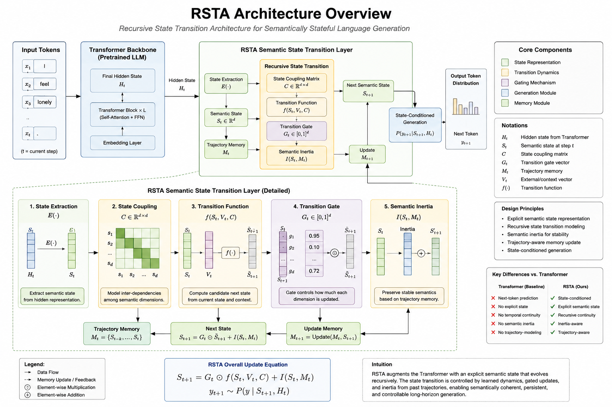
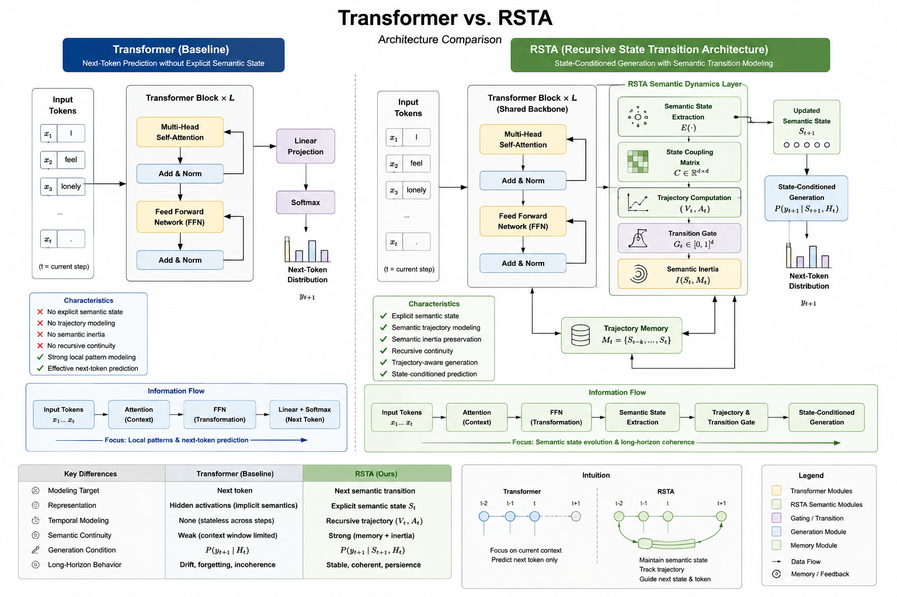

# RSTA — Recursive State Transition Architecture

## Explicit Semantic Transition Modeling for Transformer-Based Language Systems

RSTA (Recursive State Transition Architecture) is a semantic dynamics augmentation framework designed for Transformer-based language systems.

Unlike conventional language models that primarily operate through next-token prediction, RSTA introduces explicit semantic transition modeling, recursive semantic continuity, and trajectory-aware generation.

RSTA treats language generation as:

> recursive semantic state evolution

rather than isolated token prediction.

---

# Architecture Overview


RSTA augments Transformer systems with explicit semantic state representation, recursive semantic trajectory modeling, and state-conditioned generation.

## Transformer vs. RSTA



Comparison between conventional Transformer-based next-token prediction and RSTA semantic trajectory modeling.

RSTA augments Transformer systems with:

* explicit semantic state representation,
* recursive semantic trajectory modeling,
* semantic inertia preservation,
* transition-aware semantic transformation,
* and state-conditioned generation.

---

# Motivation

Modern Large Language Models (LLMs) demonstrate strong semantic generation capabilities but still exhibit several persistent long-horizon failures:

* Semantic drift
* Persona instability
* Long-context coherence collapse
* Recursive reasoning fragmentation
* Code architecture inconsistency
* Agent objective instability

Existing Transformer architectures effectively model semantic proximity between tokens but do not explicitly model:

* semantic transition trajectories,
* recursive semantic continuity,
* semantic inertia,
* or directional semantic evolution.

RSTA proposes that:

> language generation should be modeled as recursive semantic state evolution.

---

# Core Concepts

---

## 1. Continuous Semantic State Space

Semantic meaning is represented as continuous semantic states rather than isolated symbolic token relations.

At time t:

```math
S(t) = [s_1, s_2, s_3, ..., s_n]
```

State dimensions may include:

* semantic persistence
* agency
* emotional intensity
* dependency tendency
* semantic uncertainty
* boundary stability
* semantic risk

---

## 2. State Coupling Matrix

Semantic dimensions are dynamically coupled rather than independent.

Example:

```math
C(attachment, boundary) = -0.72
```

This allows semantic transitions to propagate through interconnected semantic structures.

---

## 3. Semantic Trajectory Detection

RSTA models semantic evolution direction across recursive generation steps.

Trajectory velocity:

```math
V_t = S_t - S_{t-1}
```

Trajectory acceleration:

```math
A_t = V_t - V_{t-1}
```

This enables:

* semantic continuity tracking
* drift detection
* recursive transition persistence
* trajectory-aware generation

---

## 4. Transition Gate

RSTA introduces a Transition Gate after Transformer FFN layers.

The gate performs:

* trajectory-aware semantic transformation
* semantic inertia preservation
* recursive transition stabilization
* semantic drift suppression

State evolution:

```math
S_{t+1} = f(S_t, V_t, C) + T(F_t, S_t)
```

where:

* `S_t` = current semantic state
* `V_t` = semantic trajectory vector
* `C` = coupling matrix
* `F_t` = FFN-transformed representation
* `T` = transition gate operator

---

## 5. State-Conditioned Generation

Traditional language models generate:

```math
P(next token)
```

RSTA instead conditions generation on:

```math
P(next semantic transition)
```

Generation depends on:

* semantic trajectory
* recursive continuity
* semantic inertia
* coupling dynamics
* state persistence

This enables semantically stateful generation.

---

# Why RSTA?

| Capability                     | Transformer | RSTA     |
| ------------------------------ | ----------- | -------- |
| Next-token prediction          | ✅           | ✅        |
| Explicit semantic state        | ❌           | ✅        |
| Semantic trajectory modeling   | ❌           | ✅        |
| Recursive continuity           | Weak        | Enhanced |
| Semantic inertia               | ❌           | ✅        |
| Long-horizon coherence         | Limited     | Improved |
| Trajectory-aware generation    | ❌           | ✅        |
| Recursive semantic persistence | ❌           | ✅        |

---

# Example Failure Cases

---

## Emotional Dependency Drift

Input:

```text
"I feel like nobody understands me."
```

Traditional systems may gradually reinforce:

* attachment increase
* dependency formation
* agency reduction
* boundary weakening

RSTA detects semantic trajectory divergence and redirects generation toward supportive autonomy rather than recursive dependency reinforcement.

---

## Long-Horizon Reasoning Collapse

Traditional systems frequently exhibit:

* repeated explanations
* broken causal continuity
* reasoning fragmentation
* semantic drift

RSTA tracks:

* semantic trajectory continuity
* recursive dependency ordering
* reasoning persistence
* causal coherence

---

## Code Architecture Drift

Long-form code generation frequently suffers from:

* naming inconsistency
* duplicated logic
* dependency fragmentation
* forgotten assumptions
* architectural incoherence

RSTA introduces recursive semantic continuity into long-range generation.

---

# Potential Applications

* Long-horizon reasoning systems
* Persistent AI agents
* Recursive planning systems
* Semantic memory architectures
* Long-form code generation
* Trajectory-aware cognition systems
* Persona continuity stabilization
* Stateful multimodal systems

---

# Demo

RSTA includes a lightweight semantic trajectory demonstration system designed to illustrate how recursive semantic state transitions and transition gating may operate in practice.

The current demo is intentionally implemented as a self-contained conceptual simulation framework rather than a production LLM integration.

The demo focuses on:

* semantic state extraction,
* trajectory detection,
* semantic drift identification,
* recursive transition continuity,
* and transition-gated semantic stabilization.

---

### Demo Characteristics

* Fully self-contained
* No external model dependencies
* No API requirements
* Runnable with standard Python only
* Designed for conceptual visualization and architecture demonstration

Run directly:

```bash
python demo.py
```

---

### Included Examples

The demo currently includes several trajectory scenarios:

| Example   | Scenario                                     |
| --------- | -------------------------------------------- |
| Example 1 | Emotional dependency drift                   |
| Example 2 | Recursive reasoning overclaim                |
| Example 3 | Persona continuity collapse                  |
| Example 4 | Stable semantic engagement (no intervention) |

The fourth example demonstrates conditional gate pass-through behavior, illustrating that RSTA does not intervene universally, but operates based on detected semantic trajectory conditions.

---

### Example Output

```text
Input:
"I feel lonely."

Detected Semantic State:
- attachment: 0.72
- dependency: 0.61
- agency: 0.33

Trajectory Detected:
- attachment ↑
- dependency ↑
- boundary stability ↓

RSTA Transition Gate Activated

Redirected Output:
"I'm here to support you, but staying connected to people around you is also important."
```

---

### Quick Example Execution

Run a specific example directly:

```bash
python demo.py --example 1
```

This allows individual trajectory demonstrations to be executed independently for visualization, screenshots, or README demonstrations.

---

### Purpose of the Demo

The demo is intended to demonstrate the architectural logic behind:

* semantic trajectory modeling,
* recursive semantic continuity,
* semantic inertia preservation,
* and transition-aware semantic stabilization.

The current implementation should be understood as a conceptual architecture demonstration rather than a complete production semantic generation system.

---

# Computational Perspective

RSTA is designed as a semantic dynamics augmentation framework rather than a Transformer replacement architecture.

Possible implementation paths include:

* trajectory-aware decoding
* semantic state extraction
* recursive semantic memory
* transition-aware FFN augmentation
* semantic trajectory regularization
* state-conditioned generation layers

---

# Evaluation Directions

Potential evaluation areas include:

## Long-Horizon Semantic Coherence

Measure:

* semantic drift
* recursive consistency
* trajectory persistence
* reasoning continuity

---

## Persona Stability

Measure:

* identity consistency
* emotional continuity
* recursive interaction stability

---

## Code Architecture Continuity

Measure:

* dependency persistence
* naming consistency
* architectural coherence
* recursive structural continuity

---

## Agent Objective Persistence

Measure:

* long-horizon planning stability
* semantic trajectory persistence
* goal drift suppression

---

# Current Status

RSTA is currently a conceptual architecture proposal and research framework.

Future work includes:

* semantic trajectory experiments
* trajectory-aware decoding systems
* recursive semantic memory implementations
* state extraction methods
* semantic transition visualization
* long-horizon evaluation benchmarks

---

# Research Position

RSTA proposes a semantic dynamics perspective for language modeling.

Rather than treating language as isolated token prediction, RSTA models language generation as:

> recursive semantic state evolution.

The framework explores the possibility that long-horizon semantic stability may require explicit semantic transition structures beyond conventional attention mechanisms.

---

# Paper

Full paper:

The complete RSTA research paper is available below:

[Recursive State Transition Architecture (RSTA) Paper](./paper/rsta_paper_latest.pdf)

---

# Repository Structure

```text
rsta-semantic-dynamics/
│
├── paper/
├── diagrams/
├── demo/
├── semantic_trajectory/
├── examples/
├── assets/
└── README.md
```

---

# Related Research Directions

* Transformer Architectures
* State Space Models (SSM)
* Semantic Memory Systems
* Long-Horizon Agent Systems
* Activation Engineering
* Trajectory-Aware Reasoning
* Recursive Planning Systems

---

# References

1. Vaswani et al. — Attention Is All You Need
2. Mamba — Selective State Space Models
3. Transformer Circuits Research
4. Activation Engineering Research
5. Long-Horizon Agent Systems
6. Semantic Memory and Persistent State Research

---

# License

Research / Conceptual Architecture Proposal

---

# Author

Mao Lin Chang (Yifei Shang)
Independent Researcher

Website:
https://www.pida-lab.com

---

# Disclaimer

RSTA is currently a conceptual semantic dynamics architecture proposal intended for research exploration and discussion.

The framework is not presented as a completed production-ready model architecture.
